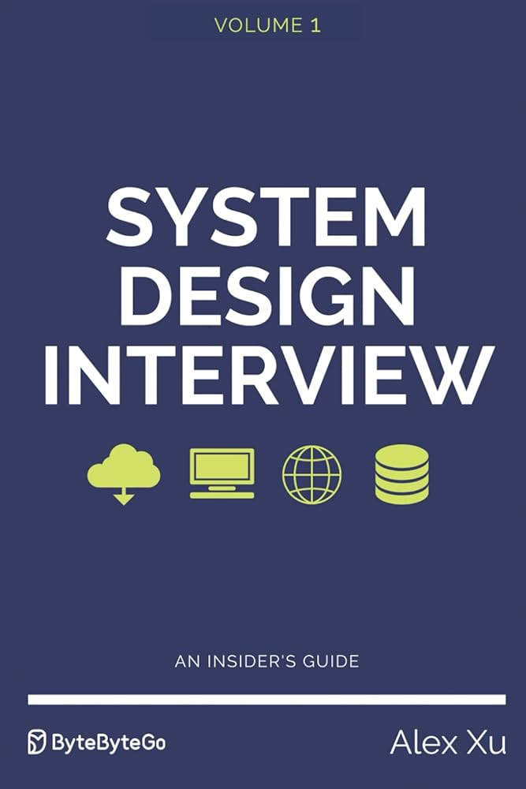

# System Design Interview - An Insider's Guide (Alex Xu)

    

## Method

This should not be an active note-taking repo; each entry should be a *review* to help solidify comprehension. The steps should be as follows:
1. **Read** the material
2. **Recount** in as much detail as possible here
3. **Re-read** the material
4. **Revise** the summary with corrections, omissions, etc.
5. **Repeat** until desired depth in summary

## Topics for later 

- [ ] non-relational database types (https://aws.amazon.com/compare/the-difference-between-relational-and-non-relational-databases/) 
- [ ] database normal forms & examples 