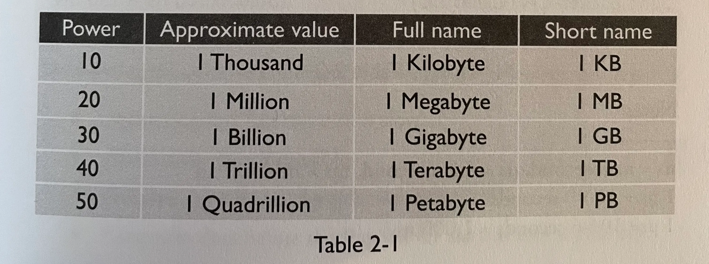
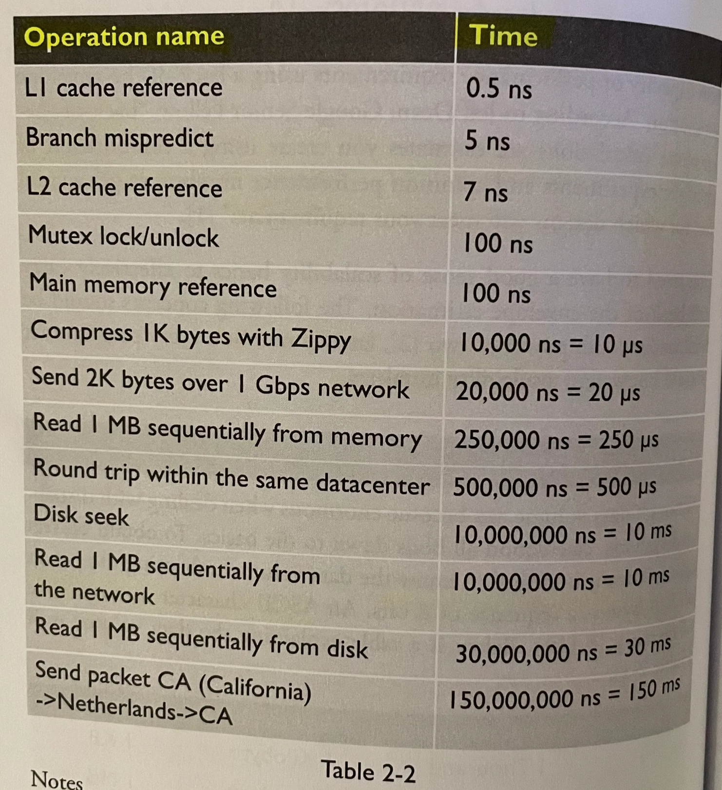
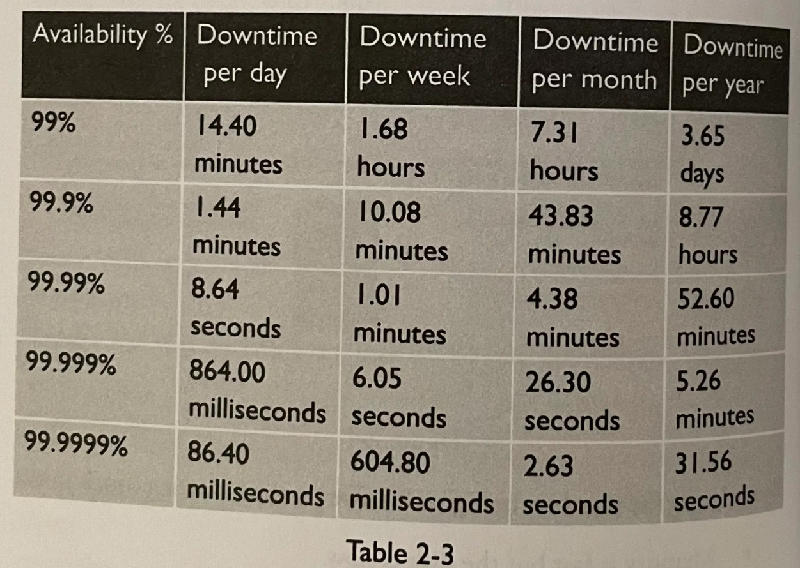
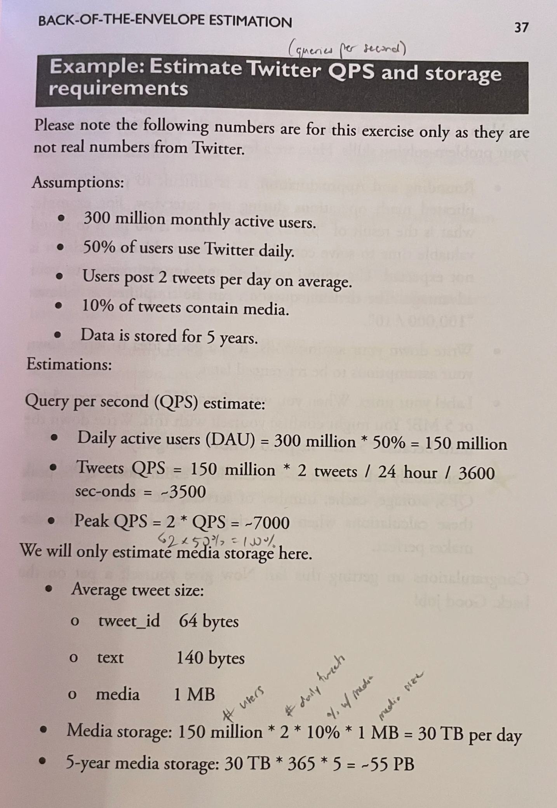

# Back-of-the-Envelope Estimation

"back-of-the-envelope calculations are estimates you create using a combination of thought experiments and common performance numbers to get a good feel for which designs will meet your requirements" -Jeff Dean

## Numbers to know

* power of two (see table below)

    

* latency numbers (see table below)
  * general bits:
    * memory is fast, disk is slow
    * avoid disk seeks/reads if possible
    * data centers take time to send data within and between, especially across regions

    

* availability numbers (see table below)
  * availability usually references from 100% availablility (0 downtime)
  * service level agreement (SLA): agreed availability between service provider and customers 

    

## Example problems
* twitter qps (queries per second) & 5-year storage
* tips:
  * the **process** is more important than the answer
  * rounding & approximation: use easier numbers to speed up computation, rather than trying to get an answer answer
  * write down assumptions
  * label all numbers
  * example problems: QPS, peak QPS, storage, cache, number of servers, etc.

    

