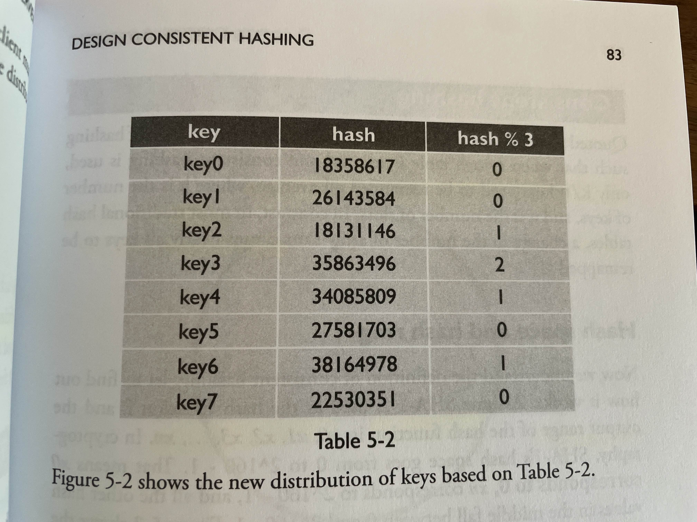
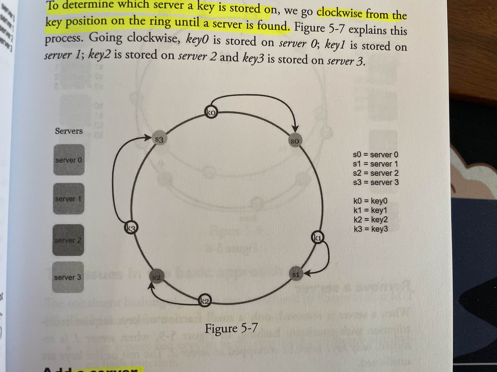
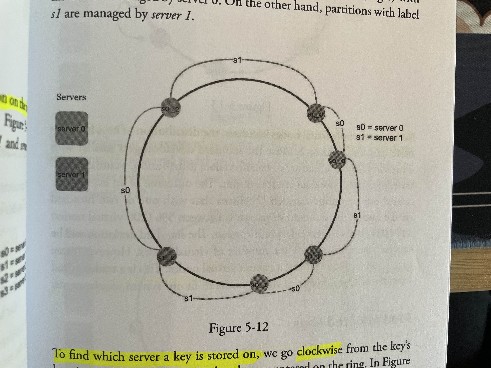

# Design Consistent Hashing

## Rehashing problem

* example hashing method: serverId = hash(key) % N, for N servers
* hash table: maps hash keys to corresponding serverId based on modulus 

* what happens when a server is added or goes down? 
  * simple mod function results in uneven distribution from original hash map, potentially causing problems
  * all keys have to be redistributed upon a single server change
  * lots of cache misses when querying because all keys may need to be remapped
* solution to limiting the effects of rehashing: **consistent hashing**
  
## Consistent hashing

* method of hashing that requires on average $k/n$ keys to be redistributed, instead of all $k$
* visualize **hash space** as a **hash ring** instead of a hash array
  * **server lookup**: determine hash key location on ring, move clockwise until first server
* basic approach:
  * spread server and key nodes around hash ring using a **uniformly distributed** hash function
  * to find corresponding server for a key, travel along has ring clockwise until first server

* two issues to basic approach:
  * when servers added/removed, impossible to guarantee that server partitions will be even 
  * no guarantee that keys will be uniformly distributed either
* **virtual nodes**/replicas: solution to issues above; each server also gets a fixed number of virtual server nodes that are also distributed across the hash ring (uniformly, necessarily not all next to each other/next to original server), but all **refer** to the original server
  * find server from hash key using the same clockwise method
  * when a virtual node goes down, only a small portion of keys (on average $k/n$) have to be redistributed (the exact range: all keys from the affected node, to the first counterclockwise server)
  * works because as the number of virtual nodes increases, the more evenly distributed the keys/data becomes by decreasing the standard deviation of the key distribution across all nodes 
  * tradeoff: more memory as more nodes are added, must be tuned to case requirements 

* **benefits of consistent hashing**: 
  * minimize number of redistributed keys
  * better horizontal scaling, as adding/removing servers has less of an overall impact on user experience
  * mitigate **hotspot key problem**: popular keys (eg. celebrities) all located on a single server may overload the server; consistent hashing helps to more evenly distribute keys to mitigate this issue
