# Design a Key-Value Store

* non-relational database that consists of *unique* keys that map to objects in a database
* desirable features:
  * high availability
  * high scalability
  * low latency
  * automatic scaling (scaling based on current traffic)

## CAP theorem
  
* when designing a **distributed** system, one can design it with at most two of the three following properties:
  * consistency: data across servers is always the same, no matter where you access it
  * availability: data will always be available to be fetched, no matter where you access it
  * partition tolerance: system can handle network failures, will continue to operate 
* key-value stores are designed based on which properties they satisfy: 
  * CP: data will always be the same for all users at all times, but may be higher latency
  * AP: data will always be available in low latency, but data may be stale
  * CA: impossible, since network partitions are inevitable and all systems must be able to handle them
  * which design is chosen depends on the requirements of the system 

## System components 

### Data partition

* split data evenly and with minimal data movement across multiple servers
* consistent hashing is a great method for achieving effective data partitions: hash the key onto the hash ring, use the next server in the ring to store the data
* other advantages:
  * automatic scaling
  * heterogeneity (different servers can have different storage sizes based on their load)

### Data replication

* data should be replicated across N servers for better reliability
* consistent hashing can be another method for this: using the hash ring, replicate data on the first N servers clockwise
* notes on replication:
  * when using virtual nodes, we want data replicated on different servers, not virtual nodes of potentially the same server; thus, only use the first N unique servers 
  * we want data to be replicated across different data centers as well, in case of data center failure

### Consistency

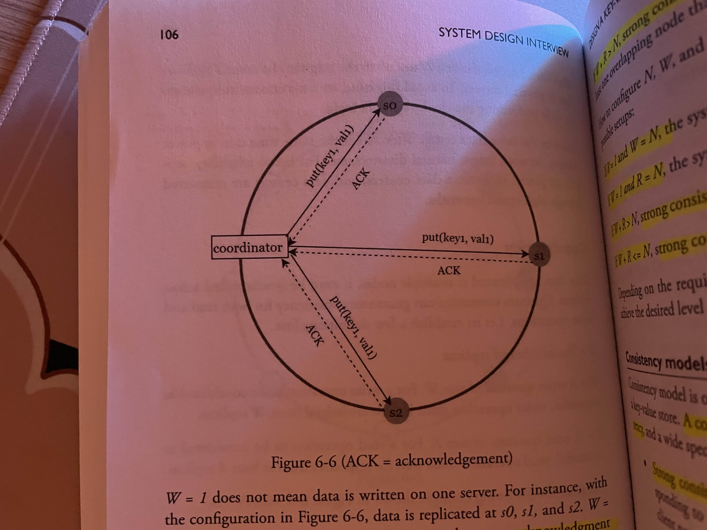

* one method is **quorum consensus**:
  * N = number of nodes/replicas
  * W = number of write *acknowledgements*
  * R = number of read *acknowledgements*
* consistency models:
  * strong consistency: W + R > N: there is at least one overlapping node that has the latest data (both read and write) for consistency
    * W + R <= N: strong consistency is not guaranteed
    * W = 1, R = N: fast write
    * R = 1, W = N: fast read
  * weak consistency: read values may be stale
  * eventual consistency: all values will be consistent, given enough time **(this is the recommended consistency model for most systems)**

### Inconsistency resolution

* common method is to use **versioning and vector clocks**
* versioning: using a counter to count the version of a datum as it is passed between servers
* vector clock: each server keeps a an array of tuples of [[Sx, vx]...] for server Sx and version vx
  * ancestor: for a given version, the version of the current datum is greater than that of every other server (no conflict)
  * sibling: there exists some version that is greater than the current datum (conflict, data is stale and must be resolved)
* disadvantages: client must be able to handle versioning logic, may become memory intensive
  * solution: remove old versions, set some threshold (not foolproof, but Amazon has used it for a while and hasn't encountered any failures with this yet)

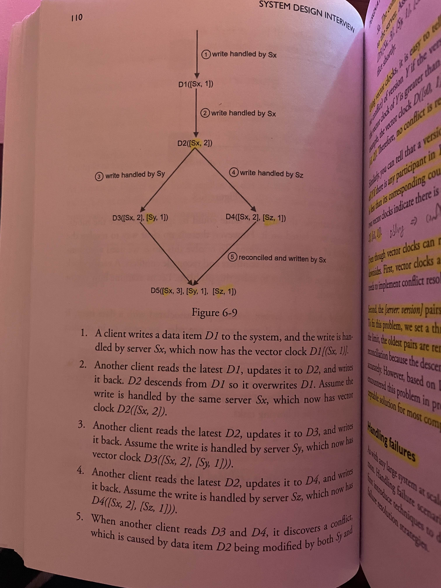

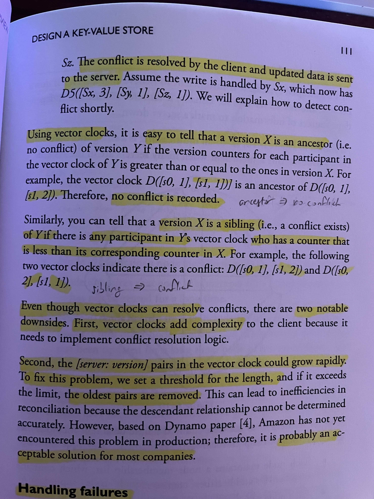

### Handling failures 

* easy solution: every server is connected to each other, servers can immediately detect failures but is communication intensive
* better solution: **gossip protocol**
  * each server contains a membership list of all other servers/nodes
  * each server increments its heartbeat and sends it out to a random set of nodes
  * when a heartbeat is received, increment it in its own membership list
  * if a server hasn't been updated in some predefined time limit, assume it's dead 

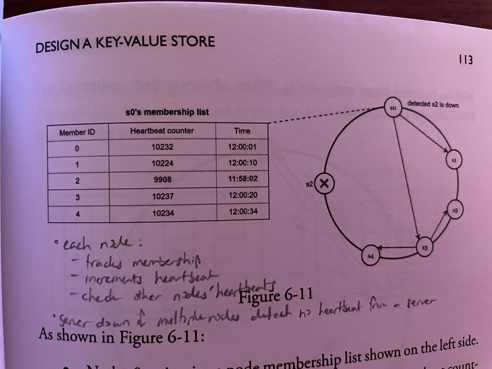

* temporary failures:
  * sloppy quorum: for better availability, can choose the first W healthy servers for write and the first R healthy servers for reads
  * hinted handoff: when a server fails, some other server takes its place temporarily; when the server comes back online, push the updated data back to the server
  
* permanent failures:
  * must keep data across replicas in sync
  * use Merkel trees:
    * essentially like a hash tree
    * hash the data in a replica (by bucket) iteratively into a root node
    * if the root node of a replica differs from another, then the data is different; go through the tree until the subnodes match, then identify where the mismathced data is 

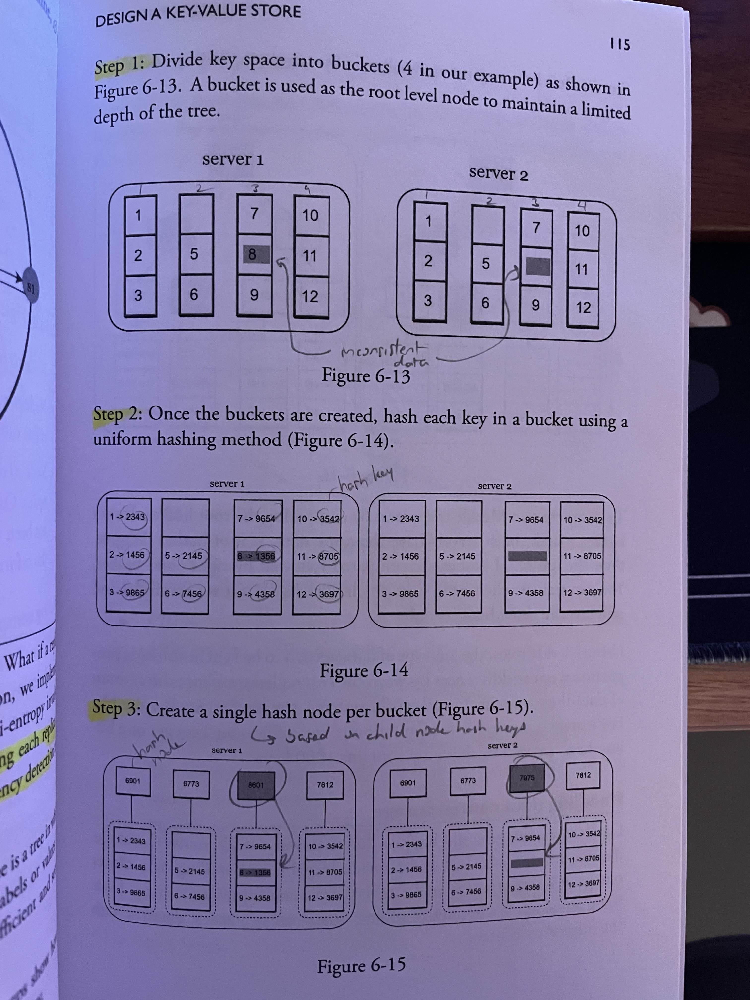

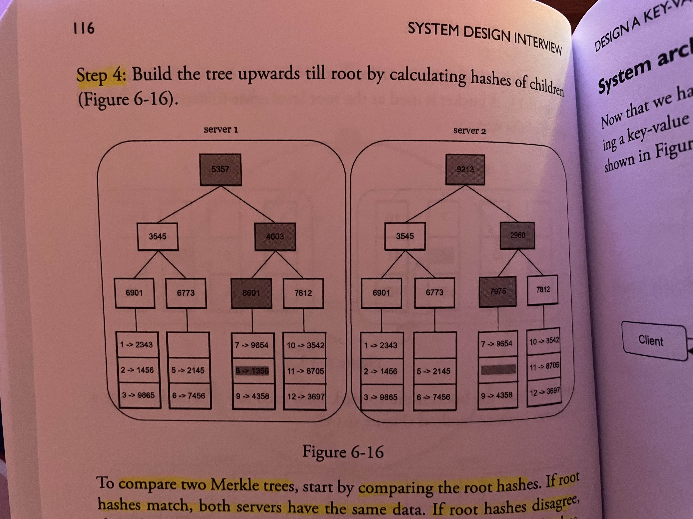

### System architecture design

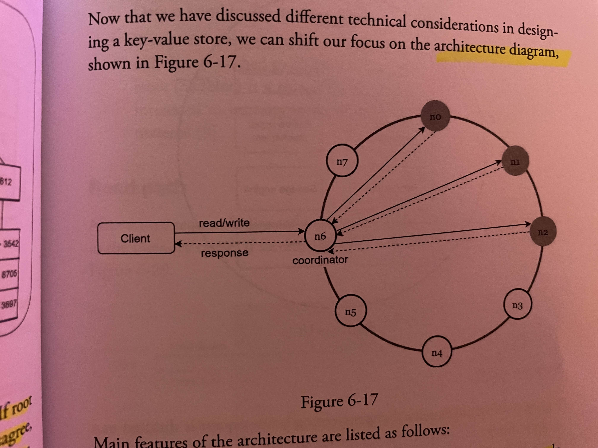

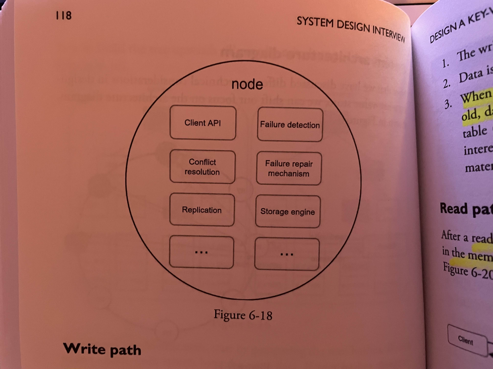

* key features:
  * clients interact with the key-value store through a simple API
  * there is a coordinator node that handles reads and writes between all other servers
  * data is decentralized so adding/removing nodes can be automatic
  * data is replicated 
  * nodes are distributed using consistent hashing
  * no single point of failures (even coordinator has some pass-off protocol), each node has equal responsibilities 

### Write/read path

* write path: 
  * write is logged in a commit log
  * data is written to a memory cache
  * when cache is full/meets some threshold, data is *flushed* to disk

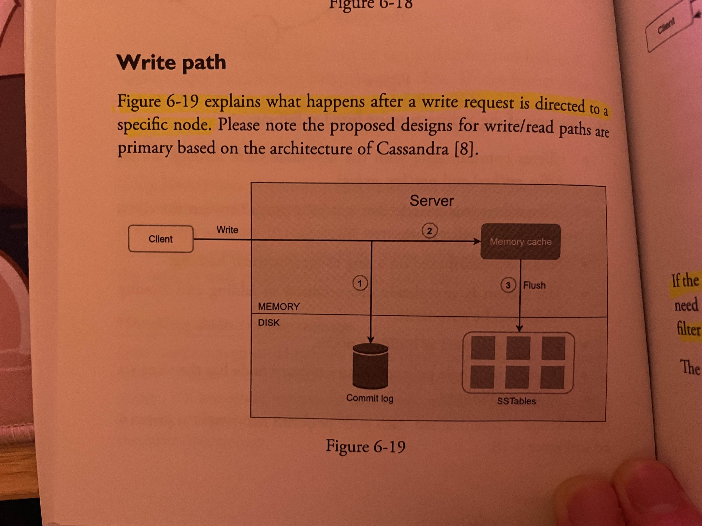

* read path:
  * check if data is in cache
  * if not, use something like a bloom filter to determine which table the data belongs in
  * fetch the data from the table
  * return data to client 

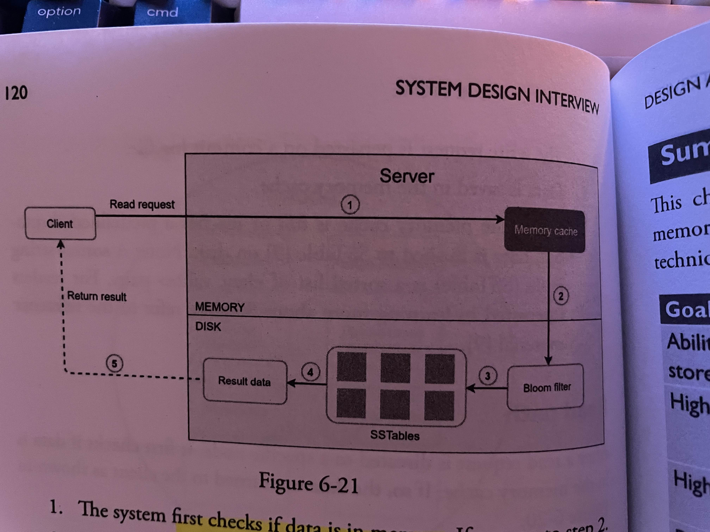

## Wrap-up

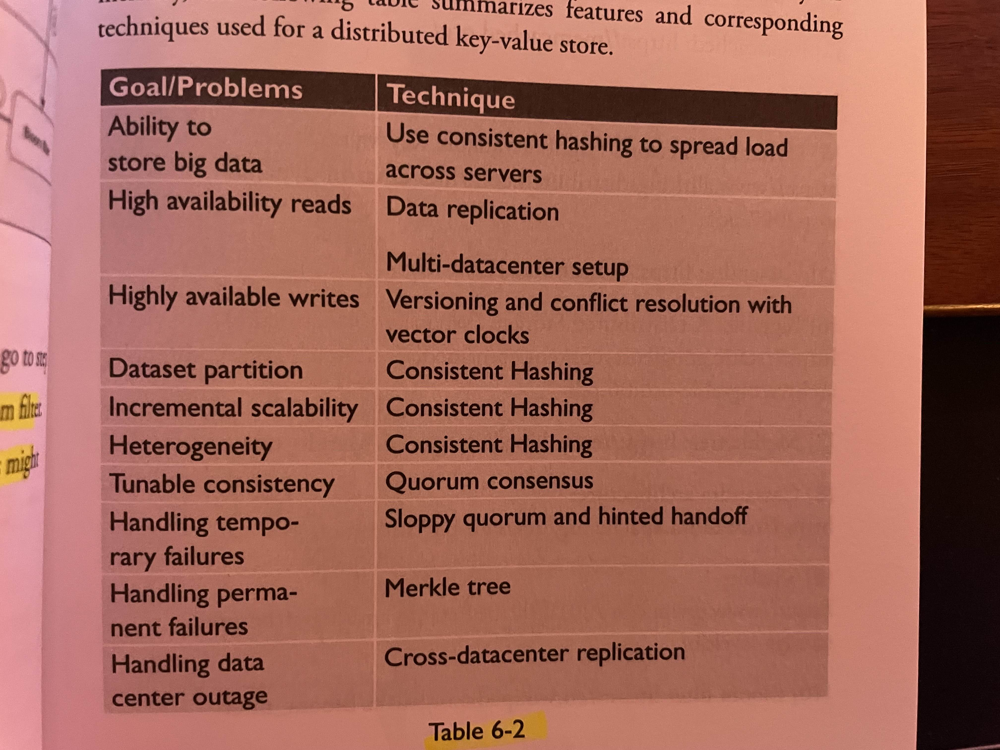